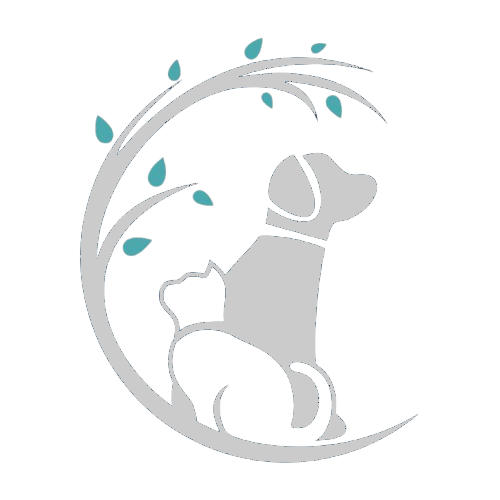



  

<a href='https://zompecuori.netlify.app/'>Live site</a>  

This is a simple html-css project for animal adoption house. Made for a school projects.

**Navigation Tree**
`
Home (index.html)  
│  
├── Animali in Adozione (adoption.html)  
│   ├── Pet Profile 1 (pet-doge.html)     ─ ─ ─┓   
│   ├── Pet Profile 2 (pet-beluga.html)   ─ ─ ─│  
│   ├── Pet Profile 3 (pet-mango.html)    ─ ─ ─├── Modulo di Adozione (adoption-form.html)           
│   ├── Pet Profile 4 (pet-biscotto.html) ─ ─ ─│    └── Successo (adoption-confirmation.html)  
│   └── (Other Pet Profiles...)           ─ ─ ─┘  
│  
├── Informazioni Adozione  
│  
┕── Contatti (contact.html)  
`

Project started: 20 February 2025

